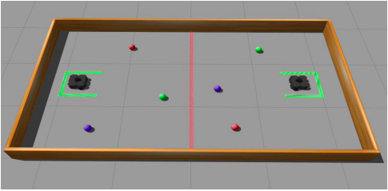
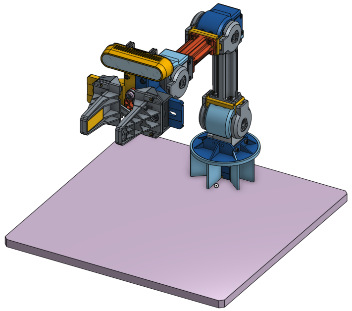
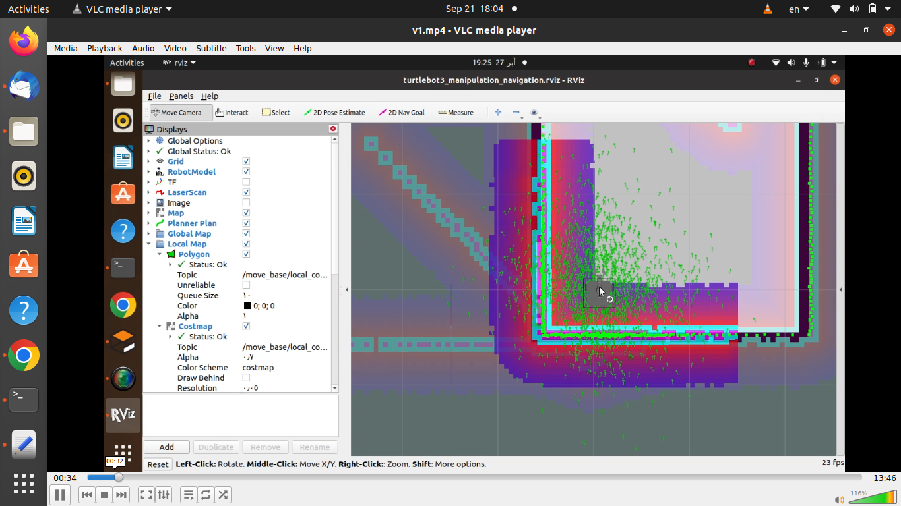

# Turtlebot3 Ball Thrower Debi Robotics Challenge-2023

DEBI Robotics Challenge 2023 is a competition between robots in one-vs-one matches in a predefined playground. The playground is divided into two identical halves separated by a red line mounted on the ground. The main mission for each team is to reduce the number of balls in their area by moving these balls to the opponent's side. Additionally, robots must act autonomously during the match without any human intervention.

## System Requirements

- ROS Noetic
- Ubuntu 20.04

## Setup Instructions

### 1. Installing Dependencies

#### TurtleBot3 Simulation Package
The TurtleBot3 Simulation Package requires `turtlebot3` and `turtlebot3_msgs` packages as prerequisites. Without these prerequisite packages, the Simulation cannot be launched.

```bash
cd ~/catkin_ws/src/
git clone -b noetic-devel https://github.com/ROBOTIS-GIT/turtlebot3_simulations.git
cd ~/catkin_ws
catkin_make
```
OpenManipulator with TurtleBot3 Download and build the package using the following commands to use the assembled OpenMANIPULATOR-X.

```bash 
cd ~/catkin_ws/src/
git clone https://github.com/ROBOTIS-GIT/turtlebot3_manipulation.git
git clone https://github.com/ROBOTIS-GIT/turtlebot3_manipulation_simulations.git
git clone https://github.com/ROBOTIS-GIT/open_manipulator_dependencies.git
sudo apt install ros-noetic-ros-control* ros-noetic-control* ros-noetic-moveit*
cd ~/catkin_ws && catkin_make
```
### 2. Launch Simulation
Load TurtleBot3 with OpenMANIPULATOR-X into Gazebo world using this command:
```bash
roslaunch turtlebot3_manipulation_gazebo turtlebot3_manipulation_gazebo.launch
```
In order to use Moveit feature, launch move_group node:
```bash 
roslaunch turtlebot3_manipulation_moveit_config move_group.launch
```
### 3. Customize the World
* Add a path from model_editor_model by adding the debi_balls file from our package to your model editor.
* Place balls in the predefined locations: ball_1 (0.5,0,0), ball_2 (0.5,-0.4,0), and ball_3 (0.5,-0.8,0).
### 4. Navigation Setup
Open navigation node in RViz and set the 2D pose estimate arrow direction to the top of the screen.

### 5. Running the Robot
  #### For Phase 1 :
  1. Launch the simulation:
   ``` bash 
   roslaunch turtlebot3_manipulation_simulations/turtlebot3_manipulation_gazebo/launch/full.launch
   ```

      1. In Gazebo, add the debi_balls file from model_editor_model to the environment.

      2. Add balls at predefined locations: ball_1 (0.5,0,0), ball_2 (0.5,-0.4,0), and ball_3 (0.5,-0.8,0).

      3.In RViz, open the navigation node and set the 2D pose estimate arrow direction to the top of the screen.

      3. Run the `trail_1.py` script to start moving the balls:
  
```bash
         rosrun turtlebot3_manipulation_gazebo trail_1.py
 ```
### For Phase 2 :

1.Follow the same setup instructions as Phase 1.

2.Add camera RealSense Gazebo plugin to your simulation setup.

3.Install Gazebo grasp plugin:

```bash
  sudo apt-get install ros-noetic-gazebo-ros ros-noetic-eigen-conversions ros-noetic-object-recognition-msgs ros-noetic-roslint
  cd catkin_ws
  git clone https://github.com/JenniferBuehler/gazebo-pkgs 

 ```
1.Replace the turtlebot3_manipulation_description and turtlebot3_manipulation_simulations packages with your submitted packages.

2.Add the python_control package to your src in your catkin_ws.

3.Build your workspace:
```bash 
cd catkin_ws
catkin build
```
**Now, you can launch the simulation and see the robot move the detected balls from one side to another. watch next youtube video**

[](http://www.youtube.com/watch?v=LFlbmNxSPBk)


**Enjoy the challenge!**


